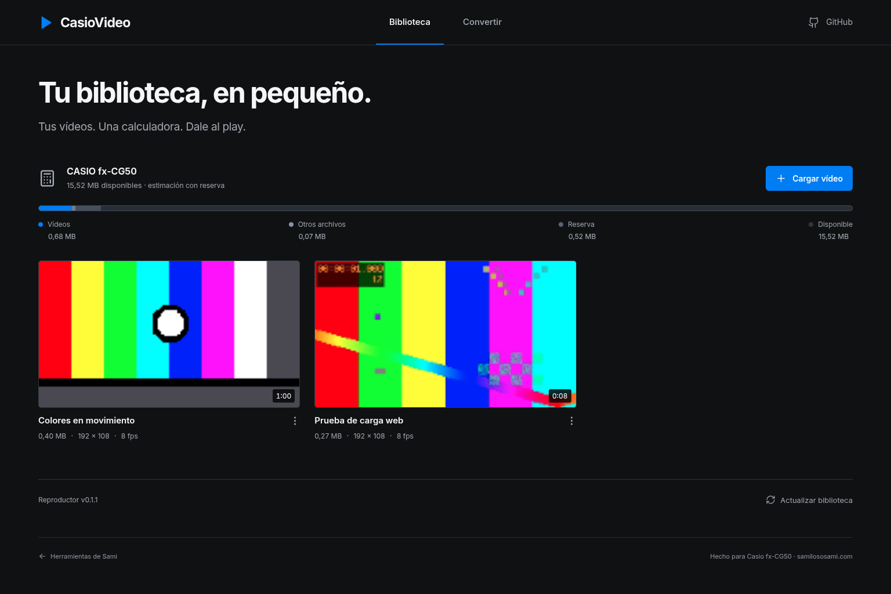
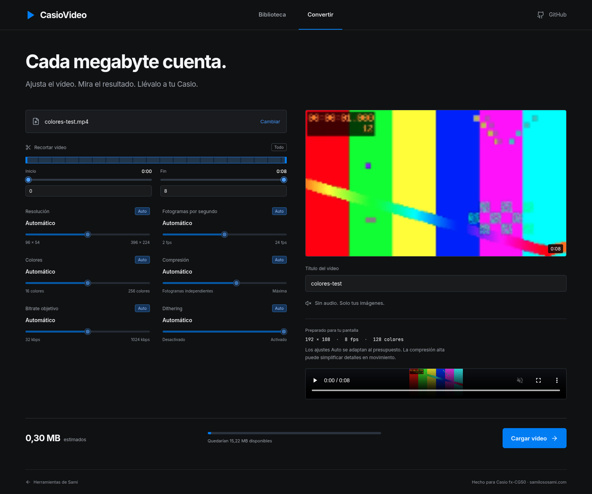

# CasioVideo

Un pequeño cine en una calculadora. Reproductor de vídeo para Casio fx-CG50, con una web que convierte, comprime y copia tus vídeos desde el navegador.

[Abrir CasioVideo](https://samilososami.com/tools/casiovideo/) · [Descargar el reproductor](https://github.com/samilososami/CasioVideo/releases/latest) · [Cómo funciona el formato](docs/cvid-format.md)

## Compatibilidad

**Probado en una Casio fx-CG50 física**, incluida la reproducción del vídeo de prueba y la interfaz. Es una calculadora **gráfica**; no hace falta que sea una calculadora con CAS.

Podría funcionar en otros modelos de la misma familia que sean compatibles con add-ins `.g3a`, como la Graph 90+E, pero **no se ha probado ni se garantiza su funcionamiento**. No basta con tener suficiente almacenamiento: también importan el procesador, el sistema operativo, la memoria disponible y las APIs del add-in.

> **Aviso sobre la pantalla:** aunque la aplicación llegue a funcionar en otro modelo, algunos textos, miniaturas, menús o controles podrían verse desajustados o cortados si cambia la resolución o el área de pantalla disponible. La interfaz actual está diseñada para la fx-CG50 y no se adapta automáticamente a cualquier resolución.

El binario publicado está compilado para fx-CG50. No se anuncia compatibilidad con modelos monocromos, ClassWiz, ClassPad, fx-CG100/Graph Math+ ni con todas las Casio por extensión. La capacidad de almacenamiento que estima la web corresponde a nuestra CG50; otros modelos o variantes pueden disponer de menos espacio.

CASIO publica una resolución de **384 × 216** para el área habitual de trabajo. El add-in usa mediante gint el framebuffer completo de **396 × 224**, incluidos los márgenes. [Ficha oficial](https://www.casio.com/mx/scientific-calculators/product.FX-CG50/) · [Familias de actualizaciones y add-ins de CASIO](https://edu.casio.com/intl/support/downloads/).

## Qué puedes hacer

- Biblioteca con miniaturas, títulos y duración. **Tres vídeos por fila** en la calculadora.
- Reproducción inmediata, pausa, saltos de **5 segundos** y barra de progreso que se oculta sola.
- Tema oscuro o claro y velocidades **0.5×, 1×, 1.5× y 2×**.
- Conversión local en el navegador: recorte, resolución, fotogramas por segundo, colores, compresión, bitrate objetivo y dithering.
- Ajustes mediante **sliders**, con modo **Auto** independiente para cada parámetro.
- Edición del título y la miniatura, borrado con confirmación y descarga de una copia.
- Instalación y actualización del `.g3a` desde GitHub Releases, comprobando su SHA-256.
- Sin audio, cuentas, telemetría ni subida de tus vídeos a un servidor.

## Primeros pasos

1. Haz una copia de seguridad de los archivos de tu calculadora.
2. Conéctala por USB y selecciona **almacenamiento USB**.
3. Abre [la web](https://samilososami.com/tools/casiovideo/) en Chrome o Edge de escritorio. Pulsa **Conectar calculadora**, elige su carpeta principal —la que contiene `@MainMem` y los `.g3a`— y permite la escritura.
4. Si falta el reproductor, pulsa **Instalar reproductor**. También puedes copiar manualmente `CasioVideo.g3a` desde [Releases](https://github.com/samilososami/CasioVideo/releases).
5. En **Convertir**, elige un vídeo compatible con tu navegador, ajusta su duración y calidad y pulsa **Cargar vídeo**. Espera a que termine la copia y su verificación.
6. **Expulsa la unidad desde el sistema operativo** antes de desconectarla. Abre CasioVideo en el menú de la calculadora.

Para probar sin convertir nada, copia también [`COLORES.cvid`](samples/COLORES.cvid) a la raíz. Es una muestra sintética de 60 segundos con colores y movimiento, de aproximadamente **0,40 MB**. No contiene material de terceros.

También puedes convertir sin conectar la calculadora, descargar el `.cvid` y copiarlo manualmente. **No basta con renombrar un `.mp4` a `.cvid`**: hay que convertirlo.

## Controles de la calculadora

| Pantalla | Tecla | Acción |
| --- | --- | --- |
| Biblioteca | Flechas | Seleccionar vídeo y desplazarse por la biblioteca |
| Biblioteca | EXE | Reproducir el vídeo seleccionado |
| Biblioteca | F6 | Abrir ajustes |
| Biblioteca | EXIT | Salir de la aplicación |
| Vídeo | Cualquier tecla | Mostrar los controles; la reproducción continúa |
| Vídeo | EXE | Pausar / continuar; reiniciar si ha terminado |
| Vídeo | Izquierda / derecha | Retroceder / avanzar 5 segundos |
| Vídeo | F6 | Abrir ajustes |
| Vídeo | EXIT | Volver a la biblioteca |
| Ajustes | Arriba / abajo | Seleccionar apariencia o velocidad |
| Ajustes | Izquierda / derecha / EXE | Cambiar el valor |
| Ajustes | EXIT / F6 | Cerrar ajustes |

El tema y la velocidad se mantienen durante la sesión, no se escriben en la flash. Al volver a abrir se usan oscuro y 1×. El cierre libera los buffers y el archivo abierto; el reinicio del punto de entrada evita el problema de salir con EXIT y no poder abrir de nuevo.

## Conversión: calidad frente a espacio

La calculadora no decodifica MP4 ni H.264. La web utiliza el decodificador de vídeo del navegador, reduce cada fotograma y construye un archivo **CVID** sencillo de leer por bloques.

| Ajuste | Opciones |
| --- | --- |
| Resolución | Auto; 96 × 54, 128 × 72, 160 × 90, 192 × 108, 264 × 148, 384 × 216, 396 × 224 |
| Fotogramas por segundo | Auto; 2, 4, 6, 8, 10, 12, 15, 20, 24 |
| Colores | Auto; 16, 32, 64, 128, 256 |
| Compresión | Auto y seis niveles, desde fotogramas sin comprimir hasta mayor tolerancia entre fotogramas |
| Bitrate objetivo | Auto y nueve presupuestos entre 32 y 1024 kbit/s |
| Dithering | Auto, desactivado o activado |

El bitrate es un **objetivo**, no un flujo de tamaño constante. Una escena casi estática comprime mucho mejor que ruido o movimiento rápido. La estimación previa muestrea el vídeo; el tamaño final puede ser diferente. Si hace falta, la conversión intenta reducir parámetros para respetar el presupuesto; si aun así no cabe, no lo copia.

Auto no significa calidad máxima ni garantiza fluidez a 24 fps. La velocidad real depende de la resolución, del contenido y de las lecturas de la flash. Para empezar, usa Auto o una resolución baja. El audio y los metadatos originales se descartan: solo se guardan los metadatos propios de CasioVideo.

## Cómo cabe y cómo se reproduce

Cada `.cvid` contiene una cabecera con versión y título, una miniatura, un índice de fotogramas y los fotogramas comprimidos. El vídeo permanece en el **almacenamiento flash**; la calculadora no carga el archivo entero en RAM.

Los píxeles usan una paleta RGB332 de hasta 256 colores. Se combinan RLE —repeticiones de píxeles— y diferencias respecto al fotograma anterior. Un fotograma independiente aproximadamente cada segundo permite saltar por el vídeo sin recorrerlo desde el principio. El reproductor mantiene un fotograma y un buffer de lectura, decodifica y adapta la imagen a la pantalla conservando las proporciones.

La compresión RLE y las diferencias exactas son sin pérdida **respecto a los píxeles ya reducidos**. Reducir resolución, colores o fotogramas, o usar tolerancia entre fotogramas, sí pierde información. [Especificación del formato](docs/cvid-format.md).

## Cuidado del almacenamiento

La web usa [File System Access](https://developer.chrome.com/docs/capabilities/web-apis/file-system-access), con permiso explícito para una carpeta. **No usa comandos USB/SCSI directos, formateos, particiones ni menús ocultos**. El reproductor solo lee archivos: no escribe en la flash durante la reproducción.

Antes de copiar, la web vuelve a inventariar los archivos, deja un margen de **0,52 MB**, comprueba el tamaño y serializa las operaciones. Después de cerrar el archivo, vuelve a leerlo y compara SHA-256. Para sustituir un archivo grande se necesita espacio para una copia adicional temporal. Si hay un error de E/S, no reintenta la escritura en bucle; si existía un archivo anterior, ofrece descargar su copia.

**El espacio libre del navegador es una estimación, no una lectura del espacio libre real del dispositivo.** Se calcula con la capacidad observada en nuestra CG50 y el tamaño de los archivos, redondeado por bloques. La API no proporciona el espacio libre real de esa unidad; `navigator.storage.estimate()` mide el almacenamiento del sitio, no el de la calculadora.

Estas precauciones reducen riesgos, pero **no garantizan la integridad de una flash averiada ni detectan todos los problemas de caché del sistema**. No desconectes durante una operación. Si aparecen errores de escritura o de sistema de archivos, detén las transferencias y conserva tus copias de seguridad.

## Desarrollo

```sh
# Web y pruebas del formato / gestor
npm ci --prefix web
npm test --prefix web
npm run dev --prefix web
npm run build --prefix web

# Reproductor: requiere fxSDK + gint y su compilador SuperH
./tools/build-firmware.sh

# Regenerar el vídeo de prueba
node tools/make-demo.mjs
```

El script acepta `FXSDK_PREFIX` y no necesita guardar dependencias en `/root` o `/home/kali`. En nuestro entorno el SDK está compartido en `/tools/codex/workspace/.fxsdk-official`, accesible tanto para Kali como para root. No hace falta ejecutar la web como root.

```text
firmware/        Reproductor C, iconos y build de fxSDK
web/             Conversor y gestor React + Vite
api/             Proxy serverless limitado a las releases de este repositorio
samples/         Vídeo sintético para probar
tools/           Compilación y generación de la muestra
tests/           Pruebas del formato y de las operaciones sobre archivos
docs/            Especificación, comprobaciones y capturas
```

El despliegue usa Vercel. El proxy únicamente sirve información y archivos públicos de nuestras releases, evitando problemas de CORS de GitHub. **Los vídeos se convierten en el cliente y nunca pasan por ese proxy.** El portfolio publica una copia versionada de este build y su función serverless bajo `/tools/casiovideo/`, sin desactivar la protección de los despliegues de Vercel.

## La web

Capturas reales del navegador, con archivos sintéticos de prueba y un volumen simulado para verificar las operaciones sin modificar una calculadora física. Las cifras de almacenamiento de estas capturas no representan el espacio libre de tu calculadora.





[Biblioteca en móvil](docs/images/library-mobile.png) · [Conversor en móvil](docs/images/converter-mobile.png) · [Pruebas y revisión de diseño](docs/verification.md).

La conexión directa requiere un navegador que implemente `showDirectoryPicker` (normalmente Chrome/Edge de escritorio). Que el diseño se adapte al móvil **no significa** que el navegador móvil pueda escribir en una calculadora USB. La alternativa es convertir, descargar el CVID y copiarlo manualmente.

## Créditos

Creado por **Sami González Kamel** · [samilososami.com](https://samilososami.com).

Construido con fxSDK/gint, React, Vite y Lucide. CasioVideo es un proyecto independiente, no afiliado a CASIO. Las marcas pertenecen a sus respectivos propietarios.
